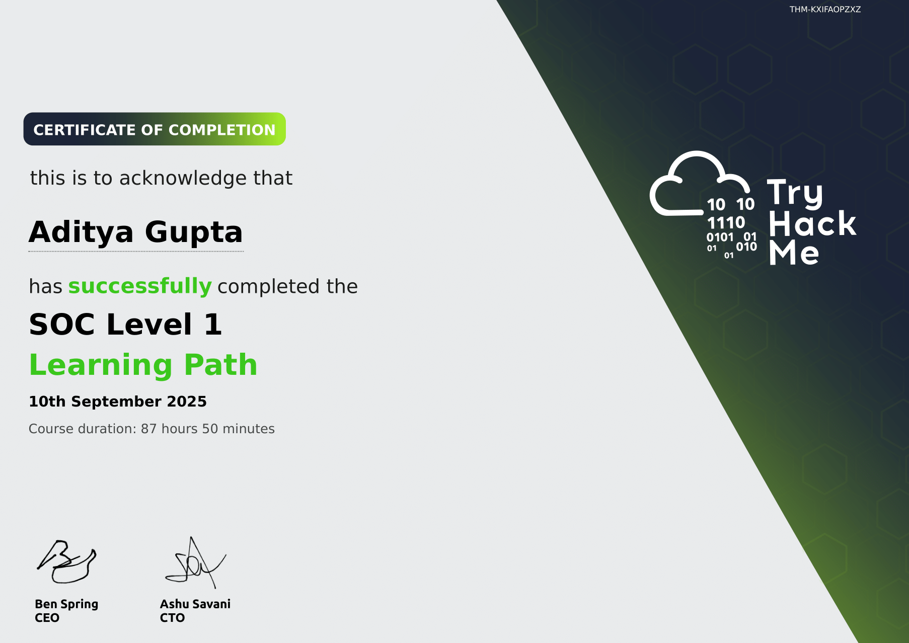

# 🔐 TryHackMe Challenges

Welcome to my **TryHackMe Challenges** repository — a collection of hands-on cybersecurity labs I've completed on [TryHackMe](https://tryhackme.com). Each folder contains detailed walkthroughs, detection logic, tools used, and key takeaways from different challenges and rooms. This project serves as both a personal learning journal and a showcase of practical cybersecurity skills for Blue Team, SOC Analyst, and detection engineering roles.

---

## 🏅 Certificate of Completion

I have successfully completed all the rooms and earned the official **TryHackMe Certificate of Completion**.  

---

## 📁 Completed Rooms

| TryHackMe Room | Description | Folder |
|------|-------------|--------|
| [**Snort Challenge - Live Attacks**](https://tryhackme.com/room/snortchallenges2) | Use Snort to detect and stop real-time threats, analyse recorded logs and PCAP files, and identify anomalies | [snort-challenge-live-attacks](./snort-challenge-live-attacks) |
| [**Retracted**](https://tryhackme.com/room/retracted) | Used Windows Powershell, Sysmon logs, and Windows Event Viewer to investigate a ransomware case | [endpoint-security-monitoring/retracted](./endpoint-security-monitoring/retracted/README.md) |
| [**TShark Challenge I: Teamwork**](https://tryhackme.com/room/tsharkchallengesone), [**TShark Challenge II: Directory**](https://tryhackme.com/room/tsharkchallengestwo) | Put TShark skills into practice and analysed network traffic. | [tshark-challenge](./tshark-challenge) |
| [**ItsyBitsy**](https://tryhackme.com/room/itsybitsy) | Demonstrated ELK knowledge to investigate an incident | [security-information-and-event-management/itsybitsy](./security-information-and-event-management/itsy-bitsy/README.md) |
| [**Benign**](https://tryhackme.com/room/benign) | Investigate a compromised host using Splunk | [security-information-and-event-management/benign](./security-information-and-event-management/benign/README.md) |
| [**Boogeyman 1**](https://tryhackme.com/room/boogeyman1) | Use Windows Event logs, Wireshark and TShark to investigate an infiltration/exfiltration case | [boogeyman-1](./capstone-challenges/boogeyman-1/README.md) |
| [**Boogeyman 3**](https://tryhackme.com/room/boogeyman3) | Use ELK with Sysmon and Windows logs to investitgate the TTPs of the Boogeyman adversary | [boogeyman-3](./capstone-challenges/boogeyman-3/README.md) |

*Note: Although I have completed all the rooms, I have only posted about the ones which I found to be the most interesting*

---

## 🧰 Skills & Tools Practiced

- 🛡️ **Intrusion Detection & Prevention**: Snort, Suricata
- 📁 **PCAP Analysis & Network Forensics**: Wireshark, TShark, tcpdump
- 🔍 **Threat Detection & Hunting**: Writing detection rules, IOC extraction, anomaly detection
- 📜 **Log Analysis & SIEM**: Splunk, ELK (Elasticsearch, Logstash, Kibana)
- 🧠 **Cybersecurity Frameworks**: MITRE ATT&CK & D3FEND, Cyber Kill Chain, Diamond Model
- 🐧 **Operating Systems**: Linux (bash, sysinternals), Windows (Event Viewer, Sysmon)
- 🔥 **Incident Response & Malware Triage**: Registry, PowerShell, process analysis
- 🛠 **Security Operations (SOC) Practices**: Alert triage, threat intel mapping

---

## 📚 About TryHackMe

[TryHackMe](https://tryhackme.com) provides an interactive environment to grow as a cybersecurity professional. It offers guided, hands-on labs that cover:

- Blue Team & Red Team methodologies
- Incident detection and response
- Threat hunting & malware analysis
- SOC workflows and real-world simulations

---

## 📬 Contact

I'm actively building my skills and looking to connect with others in cybersecurity. Please reach out to me on [LinkedIn](https://www.linkedin.com/in/aditya-gupta-security/)
